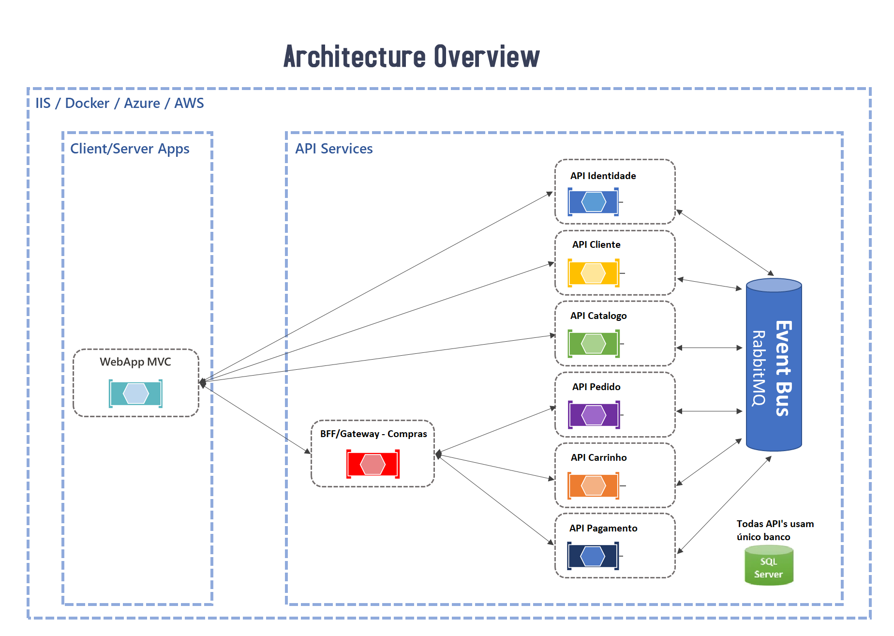
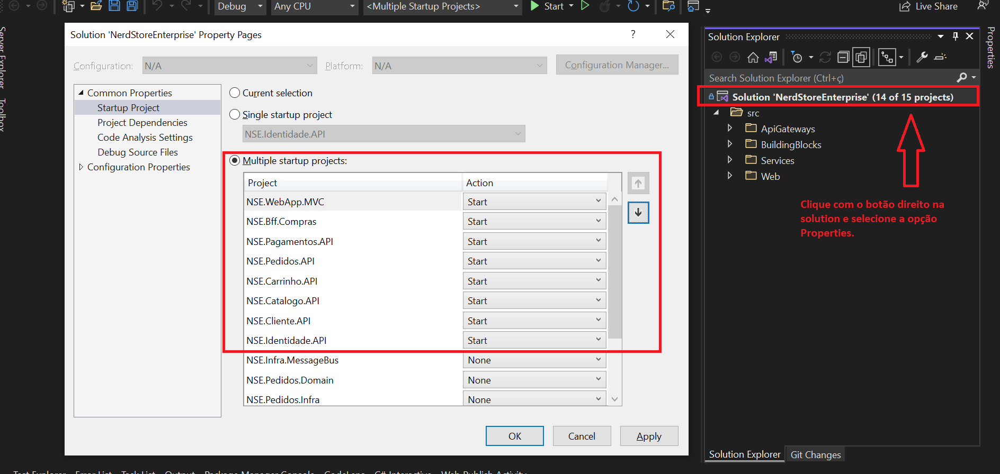
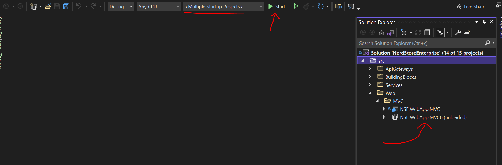

# Desenvoldedor.IO - Nerd Store Enterprise
O objetivo consiste em desenvolver uma plataforma de comércio eletrônico focada no segmento empresarial, seguindo princípios sólidos e abordagens que priorizam a escalabilidade, a segurança,  modelagem do negócio/software e afins.

## Tecnologias Utilizadas

- GRPC
- .NetCore5
- SQLServer
- Mensageria (RabbitMq)

## Visão geral da arquitetura adotada

A arquitetura proposta para esta aplicação não é um modelo ou template para qualquer outra. Cada aplicação deve ter uma arquitetura específica de acordo com o cenário e nuances do problema do negócio. Sendo assim a arquitetura de cada aplicação deve ser modelada de acordo com cenário e sua especeficidade.

A solução arquitetural adotada para esta aplicação é a **distribuída**, ou também comumente chamada de **monolíto distribuído**. Uma das suas principais características é a divisão da aplicação por [contextos delimitados](https://www.eduardopires.net.br/2016/03/ddd-bounded-context/), consequentemente distribuindo a aplicação em serviços responsáveis, onde cada um cuida de um subdomínio do negócio. A imagem abaixo demonstra a visão geral da arquitetura, contendo 6 contextos delimitados (subdomínios), que são: **Pagamentos, Clientes, Catalogos, Pedidos (core da aplicação), Carrinho e Pagamentos**.



Esta aplicação **não possui uma arquitetura em microserviços, e sim baseada em microserviços**. Isto se dá porque ela abre mão de "regras" que são necessárias em uma aplicação em microserviços. Além disso, aplicações nesse estilo arquitetural são complexas e quase sempre desnecessárias para o contexto do problema de negócio que se deseja resolver.


Dessa forma, utilizarmos uma arquitetura em microserviços dependendo da complexidade do negócio pode ser uma *"canhão para matar uma formiga"*.

<hr>

## Como executar?

Podemos executar a aplicação a partir do [Visual Studio](https://visualstudio.microsoft.com/pt-br/downloads/).

### Execução pelo Visual Studio

Para executar no Visual Studio, basta seguir os seguinte passos:

- Instalar as seguintes ferramentas: .Net 5, SQL Server (preferencialmente com o SSMS) e Docker;
- Criar uma instância do RabbitMQ a partir de um container docker por meio do seguinte comando:

    ```
    docker run -d --hostname rabbit-host --name rabbit-nerdstore -p 15672:15672 -p 5672:5672 rabbitmq:3-management-alpine
    ```

- Para criação da base de dados existem duas maneiras. Uma delas é executar o script chamado *BackupDbScript.sql* presente no diretório */sql* no banco de dados. Outra forma é rodar as *migrations* presentes no código fonte em cada um dos projetos através do [*PMC (Package Manager Console)*](https://www.learnentityframeworkcore.com/migrations/commands/pmc-commands) do Visual Studio. Caso escolha a segunda maneira basta rodar o seguinte comando em cada projeto no *PMC*:

    ```
    Update-Database -Context {nome_contexto} -StartupProject {nome_projeto_startup}
    ```

- Coloque todos os projetos para rodar no modelo *SelfHosting* ao invés do *IIS*, pois todas URL's/endpoints configurados estão usando as configurações de *SelfHosting* presentes no *launchSettings.json*;
- Configurar a solution da aplicação no Visual Studio para iniciar vários projetos, exatamente com os mesmos projetos mostrados na figura abaixo:

    

- Agora basta startar a aplicação. 

    
<hr>

## Referências

Abaixo estão os links das principais fontes para realização desse projeto, com ênfase no curso da plataforma de cursos [Desenvolvedor.IO](https://desenvolvedor.io/).

- [ASP.NET Core Enterprise Applications](https://desenvolvedor.io/curso-online-asp-net-core-enterprise-applications);
- [Dev-Store Github Repo](https://github.com/desenvolvedor-io/dev-store);
- [eShopContainers Github Repo](https://github.com/dotnet-architecture/eShopOnContainers);
- [.NET Microservices: Architecture for Containerized .NET Applications](https://docs.microsoft.com/en-us/dotnet/architecture/microservices/);
- [Design a microservice-oriented application](https://docs.microsoft.com/en-us/dotnet/architecture/microservices/multi-container-microservice-net-applications/microservice-application-design);
- [Creating a simple data-driven CRUD microservice](https://docs.microsoft.com/en-us/dotnet/architecture/microservices/multi-container-microservice-net-applications/data-driven-crud-microservice);
- [Design a DDD-oriented microservice](https://docs.microsoft.com/en-us/dotnet/architecture/microservices/microservice-ddd-cqrs-patterns/ddd-oriented-microservice).